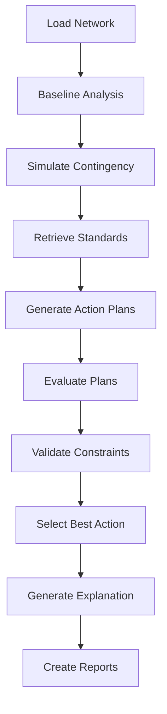

# Architecture Overview

GridOps uses a multi-agent architecture coordinated through LangGraph for contingency management in distribution networks.

## System Architecture

```
┌─────────────────────────────────────────────────────────────────────────────┐
│                           GridOps Agentic AI System                          │
├─────────────────────────────────────────────────────────────────────────────┤
│                                                                              │
│  ┌────────────────────────────────────────────────────────────────────────┐ │
│  │                      LangGraph Orchestrator                             │ │
│  │  ┌──────────┐  ┌──────────┐  ┌──────────┐  ┌──────────┐  ┌──────────┐ │ │
│  │  │ Planner  │→ │PowerFlow │→ │Constraint│→ │Explainer │→ │ Report   │ │ │
│  │  │  Agent   │  │  Agent   │  │ Checker  │  │  Agent   │  │Generator │ │ │
│  │  └──────────┘  └──────────┘  └──────────┘  └──────────┘  └──────────┘ │ │
│  │       ↓              ↓              ↓              ↑                   │ │
│  │  ┌─────────────────────────────────────────────────────────────────┐  │ │
│  │  │                    Retrieval Agent                               │  │ │
│  │  │              (IEEE Standards & Best Practices)                   │  │ │
│  │  └─────────────────────────────────────────────────────────────────┘  │ │
│  └────────────────────────────────────────────────────────────────────────┘ │
│                                    ↓                                         │
│  ┌────────────────────────────────────────────────────────────────────────┐ │
│  │                    Power System Analysis Layer                          │ │
│  │  ┌─────────────┐  ┌─────────────┐  ┌─────────────┐  ┌─────────────┐   │ │
│  │  │ pandapower  │  │  NetworkX   │  │ Constraint  │  │   Network   │   │ │
│  │  │ Power Flow  │  │  Topology   │  │ Validation  │  │  Analysis   │   │ │
│  │  └─────────────┘  └─────────────┘  └─────────────┘  └─────────────┘   │ │
│  └────────────────────────────────────────────────────────────────────────┘ │
│                                    ↓                                         │
│  ┌────────────────────────────────────────────────────────────────────────┐ │
│  │                         Data & State Layer                              │ │
│  │  ┌─────────────┐  ┌─────────────┐  ┌─────────────┐  ┌─────────────┐   │ │
│  │  │   Network   │  │    State    │  │   Report    │  │Visualization│   │ │
│  │  │   Loader    │  │   Manager   │  │  Generator  │  │   Engine    │   │ │
│  │  └─────────────┘  └─────────────┘  └─────────────┘  └─────────────┘   │ │
│  └────────────────────────────────────────────────────────────────────────┘ │
└─────────────────────────────────────────────────────────────────────────────┘
```

## Component Overview

### Agents (`src/agents/`)

| Agent | Role | LLM Required |
|-------|------|--------------|
| **Planner** | Generates 2-5 candidate reconfiguration strategies | Yes |
| **PowerFlow User** | Executes power flow and applies network modifications | No |
| **Constraint Checker** | Validates voltage, thermal, protection constraints | No |
| **Explainer** | Generates human-readable technical explanations | Yes |
| **Retrieval** | Retrieves IEEE standards and best practices | No |

### Core Modules (`src/core/`)

| Module | Purpose |
|--------|---------|
| `network_loader.py` | Load IEEE test feeders and custom networks |
| `contingency_simulator.py` | Simulate N-1 and N-k contingencies |
| `state_manager.py` | Manage workflow state with LangGraph |

### Tools (`src/tools/`)

| Tool | Purpose |
|------|---------|
| `powerflow_tools.py` | Power flow analysis and network modifications |
| `network_analysis.py` | Graph-based topology analysis |

### Support Modules (`src/`)

| Module | Purpose |
|--------|---------|
| `orchestrator.py` | LangGraph workflow coordination |
| `visualization.py` | Plot generation (matplotlib) |
| `report_generator.py` | Markdown and LaTeX reports |
| `config.py` | Configuration management |

## Workflow



### Workflow Nodes

1. **load_network** - Load and prepare network model
2. **analyze_baseline** - Run baseline power flow
3. **simulate_contingency** - Apply contingency and analyze
4. **retrieve_references** - Get relevant standards
5. **generate_plans** - LLM generates action proposals
6. **evaluate_plans** - Power flow evaluation of each plan
7. **select_action** - Choose best action by safety score
8. **generate_explanation** - LLM creates technical explanation
9. **finalize** - Complete workflow and save state

## State Management

GridOps uses LangGraph's TypedDict for state management:

```python
class SystemState(TypedDict):
    # Network information
    network_name: str
    network_loaded: bool
    network_summary: Dict[str, Any]
    
    # Contingency information
    contingency_description: str
    contingency_type: str
    contingency_elements: List[int]
    
    # Analysis results
    baseline_results: Dict[str, Any]
    contingency_results: Dict[str, Any]
    constraint_violations: List[str]
    
    # Agent proposals and decisions
    proposed_actions: List[Dict[str, Any]]
    evaluated_actions: List[Dict[str, Any]]
    selected_action: Optional[Dict[str, Any]]
    
    # Explanation and references
    explanation: str
    references: List[str]
    
    # Workflow control
    workflow_status: str
    iteration: int
```

## Data Flow

```
User Input (CLI)
       ↓
┌──────────────────┐
│  main.py         │ → Parse arguments, initialize orchestrator
└──────────────────┘
       ↓
┌──────────────────┐
│  Orchestrator    │ → Coordinate agent workflow
└──────────────────┘
       ↓
┌──────────────────┐
│  Network Loader  │ → Load pandapower network
└──────────────────┘
       ↓
┌──────────────────┐
│  PowerFlow Agent │ → Run baseline analysis
└──────────────────┘
       ↓
┌──────────────────┐
│  Contingency Sim │ → Simulate outage/failure
└──────────────────┘
       ↓
┌──────────────────┐
│  Retrieval Agent │ → Get IEEE standards
└──────────────────┘
       ↓
┌──────────────────┐
│  Planner Agent   │ → Generate action proposals (LLM)
└──────────────────┘
       ↓
┌──────────────────┐
│  PowerFlow Agent │ → Evaluate each proposal
└──────────────────┘
       ↓
┌──────────────────┐
│  Constraint      │ → Validate constraints, score safety
│  Checker         │
└──────────────────┘
       ↓
┌──────────────────┐
│  State Manager   │ → Select best action
└──────────────────┘
       ↓
┌──────────────────┐
│  Explainer Agent │ → Generate explanation (LLM)
└──────────────────┘
       ↓
┌──────────────────┐
│  Report Generator│ → Create Markdown/LaTeX reports
│  Visualizer      │ → Generate plots
└──────────────────┘
       ↓
    Output Files
```

## Technology Stack

| Layer | Technology |
|-------|------------|
| **Orchestration** | LangGraph |
| **LLM Integration** | LangChain (OpenAI, Anthropic) |
| **Power Flow** | pandapower |
| **Graph Analysis** | NetworkX |
| **Visualization** | Matplotlib, Plotly |
| **Configuration** | Pydantic, python-dotenv |
| **Logging** | Loguru |
| **Reports** | Jinja2, PyLaTeX |

## Next Steps

- [Agents Deep Dive](agents.md) - Detailed agent documentation
- [Workflow Details](workflow.md) - Workflow node details
- [State Management](state-management.md) - State structure and transitions
